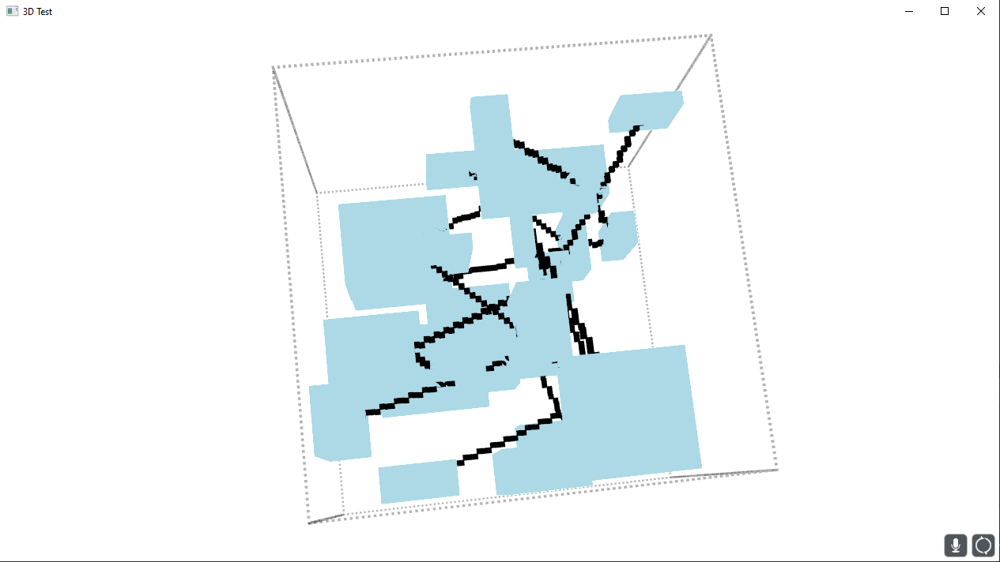
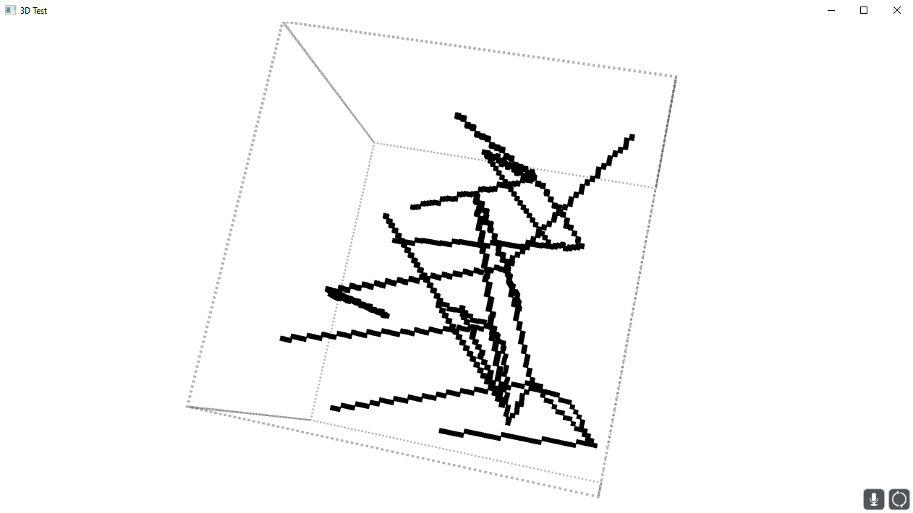

# JavaFX-3D
A program to mess around with 3D objects in JavaFX. Here, there are individual nodes, which are rectangular boxes of random width and height.
These nodes are placed in a rectangular bound, also randomly. Then the center point of some nodes are connected to one another; however, no two connectors can be intersecting.

### Here are the nodes in light blue with the connectors in black

### Here are the connectors themselves, without the nodes

